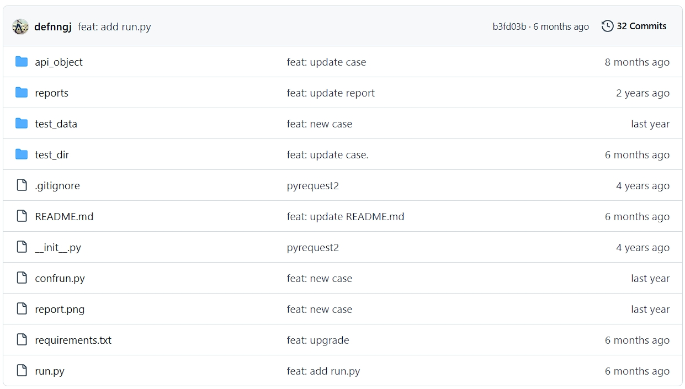
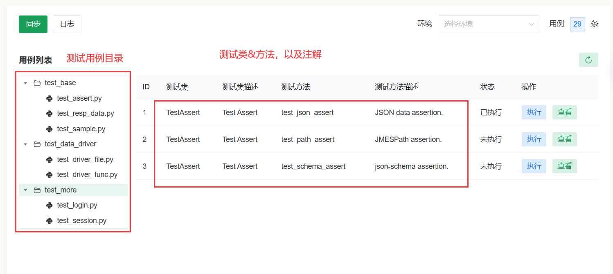

# seldom-platform

> Write your automated test cases based on Seldom framework and leave the rest to the platform.

基于Seldom框架编写你的自动化测试用例，剩下的事情交给平台.

>  这根传统的测试平台非常不一样，传统的测试平台创建用例是非常低效的，也非常不灵活。但是，平台的优势在于维护测试用例的用例的管理，定时任务，以及结果的可视化管理。selenium-platform可以解析seldom框架编写的自动化用例。~ 这是一个完美的方案。

## seldomQA 架构

🐍 **seldom**

> 通过seldom框架编写自动化测试用例。

🌐 **Github/gitee托管项目代码**

💻 **seldom-platfrom**

> 通过seldom-platfrom平台解析用例，执行、查看结果、定时任务...

## 功能支持

### 支持测试类型：

- API ✔️   
- Web UI ✔️ 
- App UI ❌（暂不支持）

> 注：App不支持并不是无法支持，App的运行需要平台接入真机，体验平台部署在阿里云不支持。

### 功能开发进度：

| 功能      | 子模块   | 进度 |  说明 |
| --------- | -------- | ---- | ---- |
| 登录&注册 | -        | ✔️    |  -  |
|  -       | 用户权限控制 |  ✔️    |  根据自己的需求控制用户和接口权限  |
| 配置中心  | 项目配置 | ✔️    |  -  |
| -        | 环境配置 | ✔️    | 需要提供更多自动化运行配置联系作者  |
| -        | 团队配置 | ✔️    |  -  |
| 项目管理  | 用例管理 | ✔️    |  -  |
| -        | 用例标签 | ✔️   |   -  |
| -        | 任务管理 | ✔️    |   -  |
| -        | 任务定时 | ✔️    |   由 `schedule-server`服务提供  |
| 其他      | 实时日志 | 开发中..    |   -  |
| 其他      | 统计 | 开发中..    |   -  |

> 注：定时任务需要启动 [schedule-server](https://github.com/SeldomQA/schedule-server) 服务

## 项目说明

| 项目         | 说明                               | 文档                           |
| ------------ | ---------------------------------- | ------------------------------ |
| backend      | 后端: django + django-ninjia        | [link](./backend/README.md)    |
| frontendv3   | 前端：vue3 + naive-ui               | [link](./frontendv3/README.md) |
| ~~frontend~~ | 前端：vue2 + element-ui (不再维护)   | [link](./frontend/README.md)   |

> __注：__
> `frontend` 和 `frontendv3` 是两套并行开发前端项目，frontend 不再维护，推荐使用 frontendv3。

### 相关文档

[《seldom-platform平台使用手册》](https://www.yuque.com/chongshi/raflru/ghot2m)

[《seldom-platform开发&部署》](https://www.yuque.com/chongshi/raflru/uxp8h7)

## 在线体验

体验地址：http://seldom.testpub.cn/  （__请添加微信，获得体验账号__）

* 微信（WeChat）

    

* QQ官方交流群：948994709
