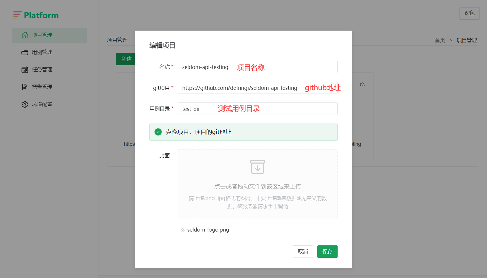
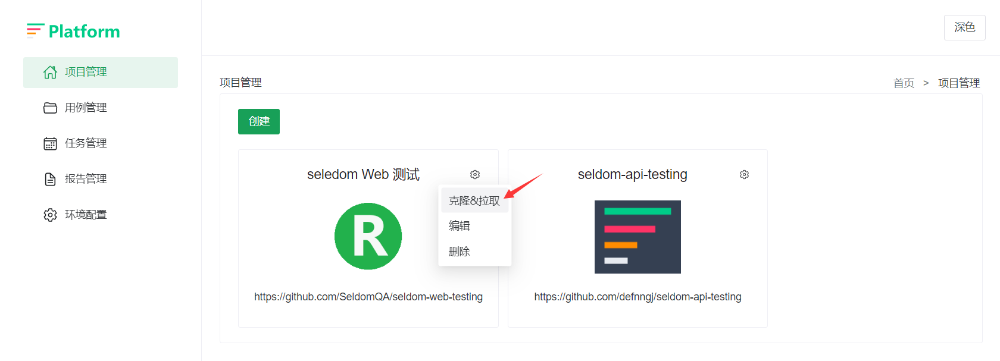
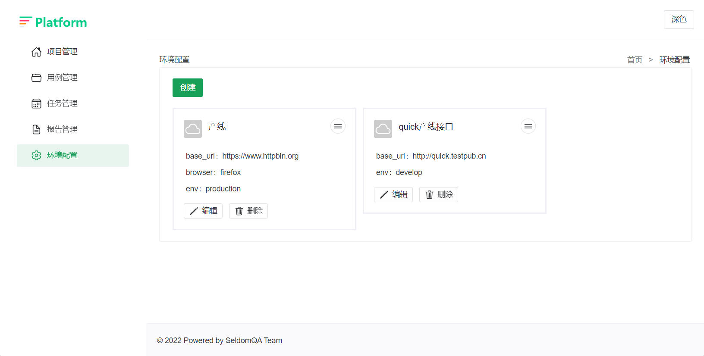
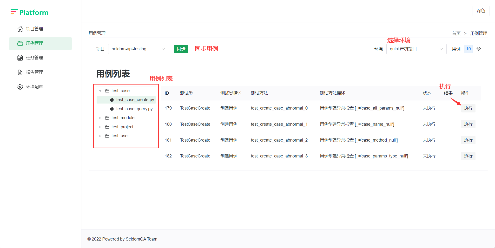

# seldom-platform

> Based on the seldom formwork test platform.

基于seldom框架的测试平台。

## Project

|  项目   | 说明  |  文档  |
|  ----  | ----  | ----  |
| backend  | 后端: django + django-ninjia |  [link](./backend/README.md)   |
| frontend  | 前端：vue2 + element-ui |  [link](./frontend/README.md)  |
| frontendv3  | 前端：vue3 + naive-ui |  [link](./frontendv3/README.md) |

> __注：__
> `frontend` 和 `frontendv3` 是两套并行开发前端项目，选择哪个取决于你的个人喜好。

## seldomQA 架构

## ToDo
- [x] 项目管理 ✔️
- [x] 用例管理 ✔️
- [x] 环境管理 ✔️
- [ ] 登录注册 ⌛
- [ ] 任务管理 ⌛
- [ ] 任务报告

## Function

### 项目管理

1. 创建&编辑项目

2. 克隆&拉取项目代码

### 环境管理

### 用例管理

