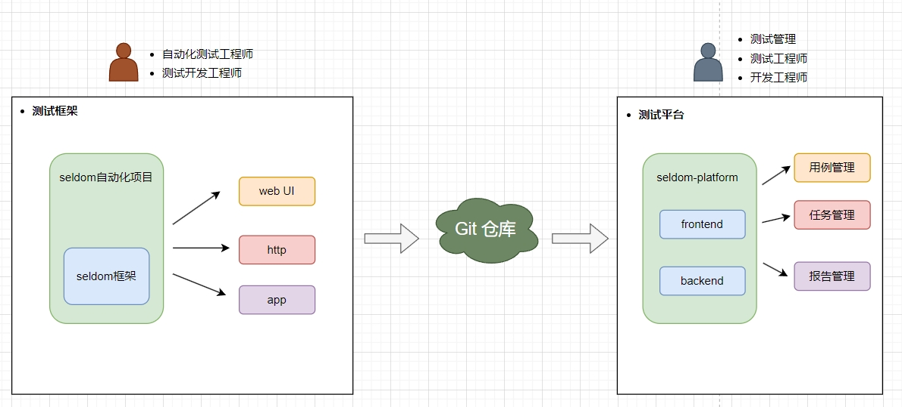
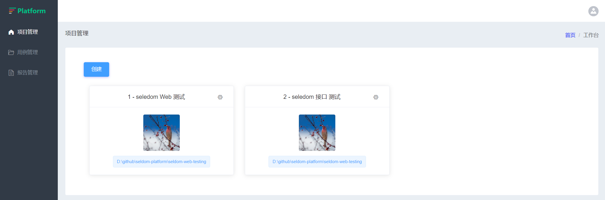
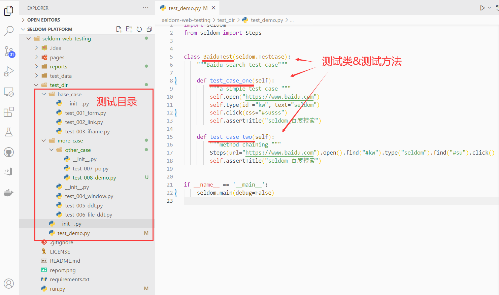
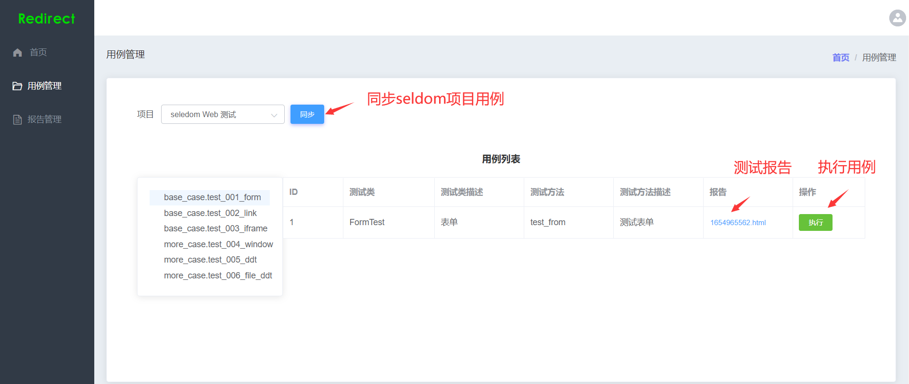
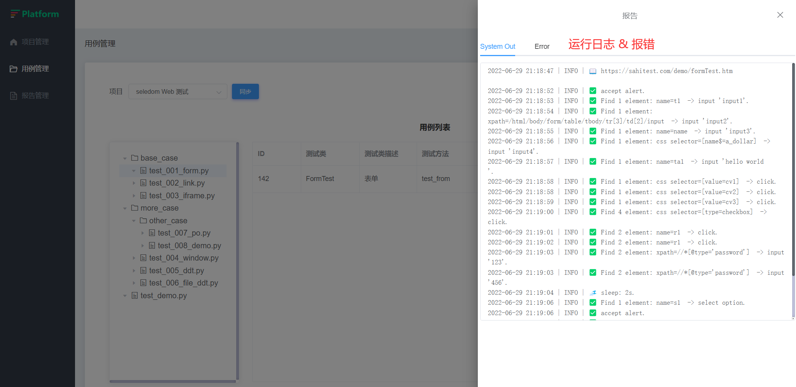

# seldom-platform

> Based on the seldom formwork test platform.

基于seldom框架的测试平台。

## Project

|  项目   | 说明  |  文档  |
|  ----  | ----  | ----  |
| backend  | 后端: django + django-ninjia |  [link](./backend/README.md)   |
| frontend  | 前端：vue2 + element-ui |  [link](./frontend/README.md)  |
| frontendv3  | 前端：vue3 + naive-ui |  [link](./frontendv3/README.md) |
| seldom-web-testing  | 接入平台的seldom web项目 |  [link](./seldom-web-testing/README.md) |

__注：__

1. `frontend` 和 `frontendv3` 是两套并行开发前端项目，选择哪个取决于你的个人喜好。
2. `seldom-web-testing` 只是为了方便平台开发调试，可以接入任何seldom自动化项目。

## seldomQA 架构

## ToDo
- [x] 项目管理 ✔️
- [x] 用例管理 ✔️
- [ ] 测试任务 ⌛
- [ ] 测试报告
- [ ] 测试统计

## Function

* 项目管理

* seldom项目代码。

* 平台解析seldom项目（目录、文件、类、方法）

* 用例执行日志

