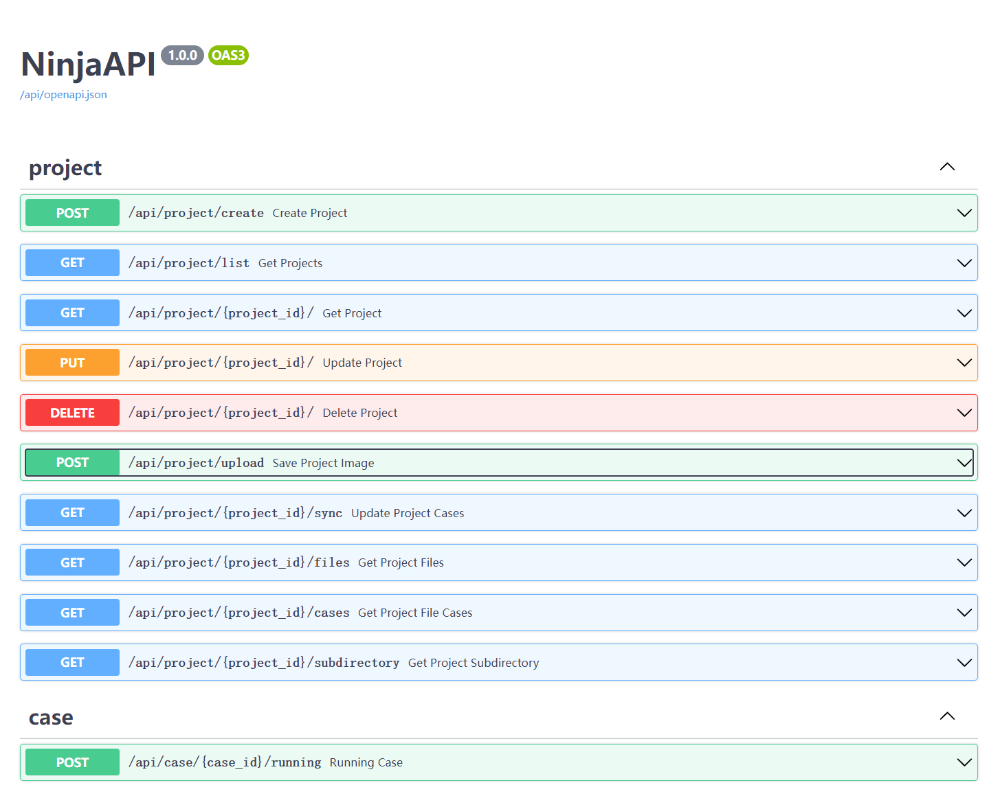

# django-ninja
基于django 的后端项目。

## 主要技术栈
* django
* django-ninja
* seldom

## 安装

* 安装依赖

```shell
> pip install -r requirements.txt
```

* 执行数据库同步

```
> python manage.py makemigrations
> python manage.py migrate
```

* Redis
  - Windows: https://github.com/tporadowski/redis
  - Linux：https://github.com/redis/redis

```shell
> redis-server  # 启动redis
```

## 运行

### 开发运行

```shell
> python manage.py runserver
```

### 部署运行

> 部署事项：
> 1. uwsgi 推荐在Linux上安装，用pip安装。
> 2. 修改`uwsgi.ini` 中项目路径，带 `->` 配置项需要修改。
> 3. 关闭 `backend/setting.py` 文件中设置 `debug=False`。

* 安装 uwsgi

```shell
> pip install uwsgi
```

* 命令启动
```shell
> uwsgi --http 127.0.0.1:8080 --chdir /home/app/seldom-platform/backend/ --wsgi-file backend/wsgi.py --master --processes 4 --threads 2
```

配置文件启动（参考`uwsgi.ini`文件）
```shell
> uwsgi --ini uwsgi.ini
```

## 查看接口

* 浏览器访问：http://localhost:8000/api/docs



* 健康检查接口：http://localhost:8000/api/ping
