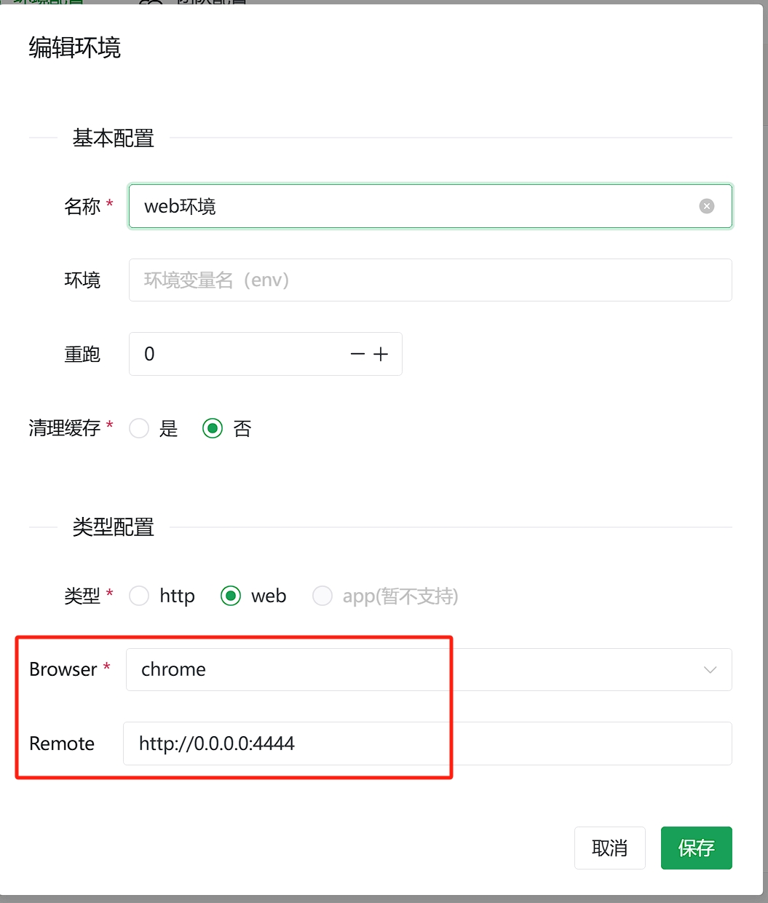

# 更多部署细节

## Web环境部署

Web环境需要用到`浏览器`和`浏览器驱动`，如果是使用的云服务器Linux，那么默认是没有的。这里推荐使用：docker-selenium

docker-selenium: https://github.com/SeleniumHQ/docker-selenium

### 通过官方仓库安装 Docker（推荐方式）

在 Ubuntu 上安装 Docker 有多种方式，这里提供一种常见方式（__如果是你已经安装了docker，请跳过！__）：

* 安装必要依赖包：

```bash
# 更新软件包索引
sudo apt-get update
# 安装必要的依赖包
sudo apt-get install -y apt-transport-https ca-certificates curl software-properties-common
```

* 添加 Docker 的官方 GPG 密钥：

```bash
# 默认
curl -fsSL https://download.docker.com/linux/ubuntu/gpg | sudo apt-key add -
# 国内阿里云
curl -fsSL http://mirrors.aliyun.com/docker-ce/linux/ubuntu/gpg | sudo apt-key add -
```

* 将 Docker 仓库添加到 APT 源：

```bash
# 默认（可选）
sudo add-apt-repository "deb [arch=amd64] https://download.docker.com/linux/ubuntu $(lsb_release -cs) stable"
# 国内阿里云（可选）
sudo add-apt-repository "deb [arch=amd64] http://mirrors.aliyun.com/docker-ce/linux/ubuntu $(lsb_release -cs) stable"
# 更新
sudo apt-get update
```

* 安装 Docker，以及验证：

```bash
# 安装
sudo apt-get install -y docker-ce docker-ce-cli containerd.io
# 查看状态
sudo systemctl status docker
```

### 安装docker-selenium

下面是基于阿里云安装`selenium`，申请的服务器比较垃圾，这里就启动了一个 chrome 容器。

```shell
# 拉取镜像
docker pull 9bt26at4.mirror.aliyuncs.com/selenium/standalone-chrome:latest
# 启动容器
docker run -d -p 4444:4444 -p 7900:7900 --shm-size="2g" 9bt26at4.mirror.aliyuncs.com/selenium/standalone-chrome

# 查看容器
docker ps
CONTAINER ID   IMAGE                                                     COMMAND                  CREATED         STATUS         PORTS
                                                            NAMES
8e5bb1825dcc   9bt26at4.mirror.aliyuncs.com/selenium/standalone-chrome   "/opt/bin/entry_poin…"   4 minutes ago   Up 4 minutes   0.0.0.0:4444->4444/tcp, :::4444->4444/tcp, 0.0.0.0:7900->7900/tcp, :::7900->7900/tcp, 5900/tcp   distracted_lamarr

# 查看你容器日志
> docker logs -f 8e5bb1825dcc
```

与这个容器对应的前端配置：



