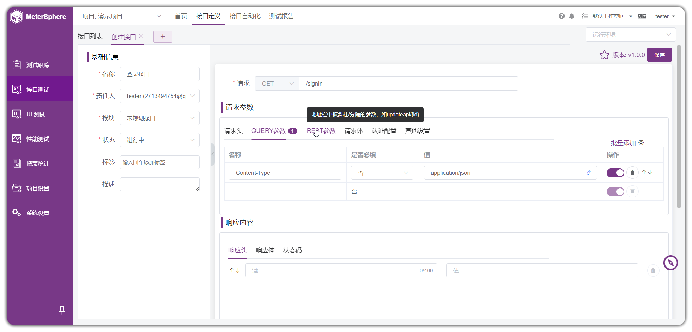

# 颠覆传统的自动化测试平台

## 1. 传统的自动化测试平台

近些年，中等以上规模的公司测试团队都在建设自己的自动化测试平台。主要要以 `HTTP接口测试` 和 `性能测试` 为主；一些平台还支持 `Web UI测试`和`App UI`测试等，试图通过UI界面配置来替代`代码自动化测试编写`。

图：来自MeterSphere平台。

自动化测试平台的好处，显而易见。

* **降低使用门槛**：不需要测试人员懂编程语言和测试库。
* **可视化的用例管理**：可以清晰地查看和编辑、统计用例。
* **历史结果统计与分析**：可以通过各种维度统计测试相关指标。

然而，自动化测试平台的缺点，也很明显。

* **用例的编写效率**：相比较于代码编写用例，UI配置的效率是比较低的。
* **很难重构**：对于用例的编写，需要不断地抽象和封装，来调整用例的编写，然而，平台很难做到这一点。
* **对于复杂用例的限制**：对于复杂的场景用例不支持，或需要通过非常复杂的配置。
* **持续的投入成本**：一个企业级的测试平台，需要不断地投入开发资源去维护升级，来应对各种业务需求。

隐含缺点，没错！还有无法放到台面上说的缺点。

* **对于测试工程编程能力的限制**：少部分测试开发工程师通过开发平台得到技能的成长。大部分的测试工程师的技能被限制在测试平台使用层面。

## 2. 框架与平台之争

当我们决定为公司引入自动化测试的时候，必然会遇到 使用框架编写，还是通过平台编写的问题。

### 框架的优势:

* **灵活高**：当你具备编程能力，就能体会到编程的方式编写自动化用例有很高的可控性。例如：`if 判断`、`for 循环`、`封装`、`变量传递`、`参数加密` 等等，编写用例非常简洁高效。

* **扩展方便**：我们可以通过库的方式无限扩展框架的能力，例如：需要用到`MySQL`数据库，安装个`pymysql`库就可以；需要实现`AES`加密，安装个`pycryptodome`库就可以了。

* **利于测试工程师的成长**：这一点其实也挺重要的，在编写自动化测试代码的过程中会对编程语言有更多的使用经验，针对业务功能的测试的理解也会更加深刻；当然，技能的提升对于升职、跳槽都是有益处。

### 平台的优势:

* **用例管理更透明**：通过平台管理用例，可以轻松地查看用例，统计用例的数量。

* **更多运行方式**：平台支持更多的运行方式，单个用例运行，任务执行，定时执行等，平台可以轻松实现更多运行方式。

* **便于数据统计**：通过平台更便于测试数据的统计。`天/周/月/年执行次数`，`天/周/年/成功率`等。

那么，是否有一种方案可以兼顾到 `框架` 和 `平台` 各自的优势呢？ 

## 3. Seldom-platform自动化测试平台

### 3.1 平台技术方案

> 这根传统的测试平台非常不一样，传统的测试平台创建用例是非常低效的，也非常不灵活。但是，平台的优势在于维护测试用例的用例的管理，定时任务，以及结果的可视化管理。selenium-platform可以解析seldom框架编写的自动化用例。~ 这是一个完美的方案。

* seldom-platform架构

🐍 1. **seldom**

通过seldom框架编写自动化测试用例。

🌐 2. **Github/gitee托管项目代码**

将你的代码托管到git平台， `github`、`gitlab`、`gitee`或者私有git平台都可以。

💻 **seldom-platfrom**

通过seldom-platfrom平台解析用例，执行、查看结果、定时任务...

从上面的实现方案，`seldom-platform`充当了`CI`的角色，但是，又与`CI`有很大不同，`CI` 支能配置命令来执行自动化项目。Seldom-Platform可以对自动化项目做到`用例级`可视化管理。除了`不支持编写测试用例`（本来，编写测试用例也应该交给更擅长的`框架`来做。）

### 3.2 平台特点

* 零成本支持任何类型测试

当我们将编写用例这件事情交给 `框架` 来完成之后，那么平台可以几乎零成本的实现任何类型的测试： `Web UI`、`App UI`、`HTTP`、`WebSocket`、`db数据库` 等。然而，传统的自动化测试平台每种类型的测试都需要做专门的支持。

* 降低平台开发的成本

当平台不再负责用例的编写，那么成本可以得到很大的降低。想象你要在平台上实现用例的创建、用例依赖、数据依赖，模块依赖。不同类型的测试交互也会有很大的差异，显然要付出不小的开发成本。

* 平衡测试编写与管理

测试工程师可以自由的使用 seldom框架编写自动化测试用例，同时，这并不会限制他技术成长。
测试管理者可以可视化的管理测试用例，查看、运行、统计等可以非常直观的管理用例。

### 相关资料

> 目前 seldom-platform 已经到 2.0版本，重构了前端交互，提供更加友好的交互设计，以及更稳定的功能。

关注平台的更多使用细节，请访问开源项目，以及在线体验平台。

seldom-platform开源平台：https://github.com/SeldomQA/seldom-platform

体验地址：http://seldom.testpub.cn/ 

虫师：SeldomQA开源项目作者，专注于提供更高效的自动化测试解决方案。新书《自动化测试框架设计》

