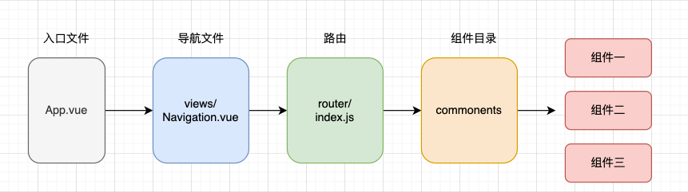

# vue-template
快速搭建vue.js前端项目的模板。

## 主要技术栈
* vue.js 2.x
* element-UI
* axios

## installation

* 安装项目依赖，根据`package.json`文件

```shell
> npm install
```

## vue环境配置

* dev (本地开发环境) - `.env.dev` 配置mock地址

```shell
> npm run serve
> npm run build
```

* local (与后端开发联调环境) - `.env.local` 配置后端开发环境地址。

```shell
> npm run local-serve
> npm run local-build
```

* local (与后端开发联调环境) - `.env.prod` 配置后端产线地址。

```shell
> npm run prod-serve
> npm run prod-build
```

* `.env.xxx`配置文件说明

```conf
NODE_ENV=dev  # 环境名称
VUE_APP_URL=http://10.2.180.77:3000/mock/11  # 接口地址
```

* 本地联调

即前后端都在本地部署的情况。

1. 修改`.env.local` 文件

```conf
NODE_ENV=local
VUE_APP_URL=  # 不设置
```

2. `vue.config.js`文件配置代理

```js
// ...
 devServer: {
    port: 8080,
    proxy: {
      '/api': { // 配置到接口包含api使用该代理
        target: 'http://127.0.0.1:8000/api', // 定义后端的接口
        changeOrigin: true,
        ws: true,
        pathRewrite: {
          '^/api': ''
        }
      }
    }
  },

```

## vue 目录架构

项目的规模不同，架构也会不一样，下面是一种相对比较简单的架构。




## E2E测试

项目中集成了 `cypress` UI自动化测试工具。

1. 为了使定位更加方便，在vue.js 代码中定义cypress专用的属性标签。

```html
<div style="padding-bottom: 20px; height: 45px;">
  <span class="span-right">
    <el-button cy-data="search-button" type="primary" @click="searchProject">搜索</el-button>
  </span>
  <span class="span-right">
    <el-input cy-data="search-project" v-model="query.name" placeholder="请输入项目名称" clearable></el-input>
  </span>
  <span class="span-left">
    <el-button cy-data="create-project" type="primary" @click="showCreate">创建</el-button>
  </span>
</div>
```

* `cy-data="xx"` 即专用标签。

2. 编写测试cypress测试用例。

```js
describe('项目管理', () => {
  it('搜索项目', () => {
    cy.visit('/#/project')
    cy.get('[cy-data=search-project]', { timeout: 3000 }).first().type('项目名称')
    cy.get('[cy-data=search-button]', { timeout: 3000 }).first().click()
  });
})
```

cypress API: https://docs.cypress.io/api/table-of-contents


* Run your end-to-end tests

```shell
> npm run test:e2e
```

## 语法规范

项目引入 `ESLint`  语法规范。

ESlint规则：https://eslint.bootcss.com/docs/rules/

在 `.eslintrc.js` 文件中配置。

* Lints and fixes files

```shell
> npm run lint
```

## 命名规范

* 文件命名

> html 小写字母+横线，例如:index.html，org-list.html
> js 小写字母+横线，例如:i18n.js，en-US.js
> vue 驼峰命名，首字母大写，例如Login.vue，HeaderUser.vue

* 变量命名

> 常量 大写字母加下划线，例如`:const ROLE_ADMIN='admin'`
> 变量 驼峰命名，首字母小写，例如`let name`，`let currentProject`
> 方法 驼峰命名，首字母小写，例如`open(){}`，`openDialog()`

* Vue组件

> 导出名称 驼峰命名，首字母大写，例如`MsUser`

* 样式规范

> 均写入vue文件的`<style scope></style>`标签内，非全局样式必须添加`scope`
> 修改ElementUI的样式，仅在必要情况下写在`<style></style>`
> 命名 小写字母+横线，例如`.menu`，`.header-menu`，`#header-top`

## Vue风格指南

https://cn.vuejs.org/v2/style-guide/

* Customize configuration
See [Configuration Reference](https://cli.vuejs.org/config/).


## 部署

* `Dockerfile` 文件

```dockerfile
FROM vue.itest.info/library/node:14 as builder   // 基于的镜像
RUN mkdir -p /opt/app        // 创建目录
WORKDIR /opt/app            // 指定工作目录

COPY . .                    // vue 安装依赖 & 打包
RUN npm install
RUN npm run build

FROM vue.itest.info/library/nginx:1.19
RUN mkdir -p /srv/vue-template/dist       // 创建 dist 目录
COPY nginx/vue.conf /etc/nginx/vue.d/     // 拷贝nginx配置
COPY --from=builder /opt/app/dist /srv/vue-template/dist   // 把打包文件 拷贝到 指定目录。
```

* `nginx` 配置

```conf
server {
    listen       8080;

    location /.well-known {
            alias /opt/www/vue.itest.info/.well-known/;
    }
    location /robots.txt {
            alias /opt/www/vue.itest.info/robots.txt;
    }
    # 后端服务配置
    location /v1/vuesrv {
        proxy_pass_request_headers      on;
        proxy_set_header Host $host;
        proxy_set_header X-Forwarded-For $proxy_add_x_forwarded_for;
        proxy_pass http://vuesrv.klook-vue:8080;  # 后端服务地址
        proxy_http_version 1.1;
        proxy_set_header Upgrade $http_upgrade;
        proxy_set_header Connection "upgrade";
        proxy_connect_timeout 4s;                #配置点1
        proxy_read_timeout 60s;                  #配置点2，如果没效，可以考虑这个时间配置长一点
        proxy_send_timeout 12s;                  #配置点3
    }

    location / {
        root /srv/vue-template/dist;    # vue打包生成的dist目录
        # autoindex on;
        try_files $uri $uri/ /index.html;   # 前端入口文件
    }
}
```