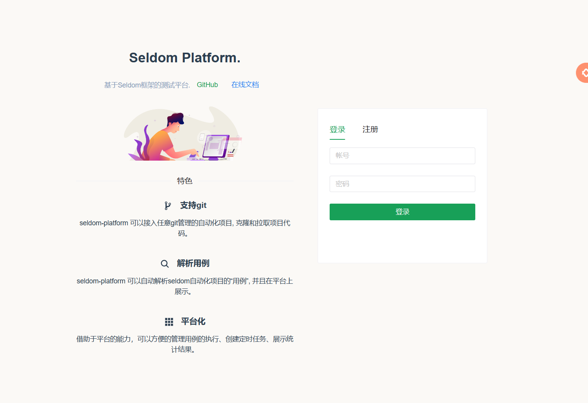

## 主要技术栈

* vue.js 3.x
* naive-ui
* typescript

## 安装

* 安装：`node.js > 16`

* 安装`pnpm`

```shell
> npm i -g pnpm
```

* 安装项目依赖，根据`package.json`文件

```shell
> pnpm install
```

## 运行

### 启动

> 推荐使用pnpm 或者 yarn进行调试、打包构建等操作

* dev (本地开发环境)

```shell
> pnpm dev
```

浏览器访问：http://localhost:5173/



## 配置

* `./src/config/base-url.ts`配置文件说明

```conf
let baseUrl = "";
let mode: string = import.meta.env.MODE;
switch (mode) {
  case "development":
    baseUrl = "http://127.0.0.1:8000"; //开发环境url
    break;
  case "production":
    baseUrl = "http://127.0.0.1:8000"; //生产环境url
    break;
}

export default baseUrl;
```
## 测试

* 运行E2E测试

```shell
> npm run test:e2e
```

## 部署

* 打包

```shell
> pnpm build
```

* 配置nginx

打包完成后，可以配置nginx服务，指定打包的 `dist/` 目录即可。

```conf
server {
    listen     80;
    server_name  seldom.testpub.cn;

    # 前端打包
    root /home/app/seldom-platform/frontendv3/dist;
    index index.html index.htm;

    keepalive_timeout   70;

    gzip on;
    gzip_min_length 200;
    gzip_buffers 4 16k;
    gzip_comp_level 6;
    gzip_types text/plain application/javascript text/css application/xml text/javascript application/json;
    gzip_vary on;
    gzip_disable "MSIE [1-6]\.";
    gzip_proxied any;

    # 前端
    location / {
      try_files $uri $uri/ /index.html;
    }

    # 后端django admin管理系统
    location /admin/ {
      proxy_pass http://127.0.0.1:8003;
      proxy_pass_request_headers on;
      proxy_set_header Host $host;
      proxy_set_header X-Forwarded-For $proxy_add_x_forwarded_for;
      proxy_set_header X-Forwarded-Proto $scheme;
      proxy_set_header X-Real-IP $remote_addr;
      proxy_set_header X-Forwarded-Port $server_port;
    }

    # 后端 django-ninja API
    location /api/ {
      proxy_pass http://127.0.0.1:8003;
      proxy_pass_request_headers      on;
      proxy_set_header Host $host;
      proxy_set_header X-Forwarded-For $proxy_add_x_forwarded_for;
    }

    # 静态资源
    location /static {
      expires 30d;
      autoindex on;
      add_header Cache-Control private;
      alias /home/app/seldom-platform/backend/staticfiles;  #django admin静态资源
    }

}
```

* 使用vite启动服务

```shell
> pnpm preview
```

## 开发规范

### 命名规范

* 文件命名

> html 小写字母+横线，例如:index.html，org-list.html
> js 小写字母+横线，例如:i18n.js，en-US.js
> vue 驼峰命名，首字母大写，例如Login.vue，HeaderUser.vue

* 变量命名

> 常量 大写字母加下划线，例如:const ROLE_ADMIN='admin'
> 变量 驼峰命名，首字母小写，例如let name，let currentProject
> 方法 驼峰命名，首字母小写，例如open(){}，openDialog()

* Vue组件

> 导出名称 驼峰命名，首字母大写，例如MsUser

* 样式规范

> 均写入vue文件的<style scope></style>标签内，非全局样式必须添加scope
> 修改ElementUI的样式，仅在必要情况下写在<style></style>
> 命名 小写字母+横线，例如.menu，.header-menu，#header-top

### 定义规范

1. 文件内部顺序 JS -> HTML -> CSS 

```js
<script lang="ts">
...
</script>

<template>
...
</template>

</style>
...
</style>
```

2. TS 部分使用  setup 定义  `<script  setup lang="ts">`

```js
<script setup lang="ts">
...
</script>
```
4. 必要的变量与方法需要注释

```js
// 初始化团队列表
const initTeam = async (teamId: number) => {
  ...
}


// 保存团队
const saveTeam = () => {
  ...
}
```

5. 风格统一
  
> 5.1.不同页面 `创建` 按钮颜色、位置、大小， `编辑`/`删除` 按钮颜色、位置、大小应该统一风格。
>
> 5.2. `删除` 按钮统一需要二次确认。
> 
> 5.3. 不同页面 弹窗（模态框）的样式、选项对齐、输入框默认提示统一风格。
          