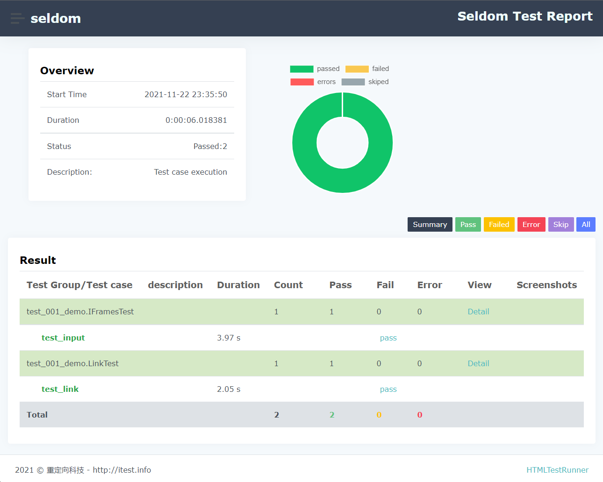

# seldom-web-testing

> seldom Web 自动化测试项目.

## 安装

```shell
> git clone https://github.com/SeldomQA/seldom-web-testing
> cd seldom-web-testing
> pip install -r requirements.txt
```

## 运行

目录结构：

```shell
mypro/
├── pages/
│   ├── xxx_page.py
├── reports/
├── test_data/
│   ├── xx_data.json
├── test_dir/
│   ├── test_xxx_xxx.py
└── run.py
```

* `pages/` page层封装目录。
* `reports/` 测试报告目录。
* `test_data/` 测试数据目录。
* `test_dir/` 测试用例目录。
* `run.py` 运行测试用例主文件。

运行用例：

```shell
> python run.py

              __    __
   ________  / /___/ /___  ____ ____
  / ___/ _ \/ / __  / __ \/ __ ` ___/
 (__  )  __/ / /_/ / /_/ / / / / / /
/____/\___/_/\__,_/\____/_/ /_/ /_/  v2.4.2
-----------------------------------------
                             @itest.info

[WDM] -

[WDM] - ====== WebDriver manager ======
[WDM] - Current google-chrome version is 96.0.4664
[WDM] - Get LATEST driver version for 96.0.4664
[WDM] - Driver [C:\Users\fnngj\.wdm\drivers\chromedriver\win32\96.0.4664.35\chromedriver.exe] found in cache

DevTools listening on ws://127.0.0.1:61378/devtools/browser/46d8e0b7-1a8f-4444-9089-060008cee591
...
2022-01-30 21:50:18 [PRINT] generated html file: file:////Users/tech/github/seldom-web-testing/reports/2022_01_30_21_46_25_result.html
2022-01-30 21:50:18 [PRINT] generated log file: file:////Users/tech/github/seldom-web-testing/reports/2022_01_30_21_46_25_log.log
.1.2.3.4.5.6.7.8.9.10.11.12.13.14.15.16.17.18.19.20%
```

## 测试报告


